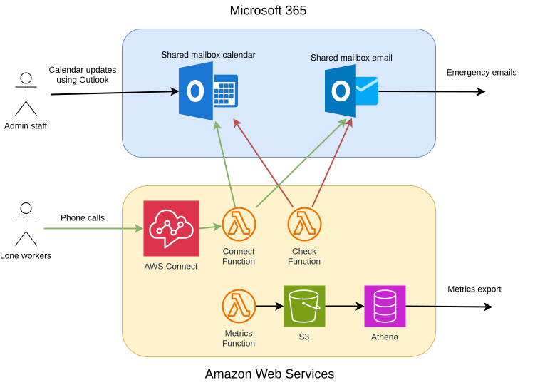

# Design and architecture

This document describes the high-level design of the lone-worker application — its main components, the parties that interact with them, and the flows between them. Per-component flow detail lives in the README for each Lambda (linked below).

The key elements of the design are shown in the architecture diagram below.

Diagram legend: black = admin/calendar management flow; green = lone-worker call flow; red = scheduled check flow.

The key flows are as follows.

- Shown in black, admin staff create and manage appointments in the shared mailbox calendar in Office 365.

- Shown in green, lone workers make calls to check in and out of appointments. (Although not shown in the diagram, their appointments are visible in their own calendars.)

    - Calls arrive at an AWS Connect instance.

    - The AWS Connect instance triggers a call to an AWS Lambda, the Connect Function (see [Connect Function README](../lambdas/ConnectFunction/README.md)).

    - The Connect Function updates calendar appointments.

    - Where the emergency option is selected by the user, the Connect Function triggers emergency mails using the shared mailbox email.

- Shown in red, the Check Function (see [Check Function README](../lambdas/CheckFunction/README.md)), an AWS Lambda, periodically checks the shared mailbox calendar. If it detects that a checkin or checkout has been missed, it updates the calendar and sends an emergency email using the shared mailbox email.

- Finally, the Metrics Function (see [Metrics Function README](../lambdas/MetricsFunction/README.md)), another AWS Lambda, reads metrics issued by the application every night and stores them for export to visualisation tools.

Shared utility code used by the Lambdas lives in the [dependencies layer](../lambdas/dependencies/README.md).

## Calendar model

The application reads the shared mailbox calendar via Microsoft Graph's `/calendarView` endpoint, which expands recurring series server-side into individual occurrences for the queried time window. Each occurrence is treated as an independent appointment: it has its own id, its own categories, and its own body, and PATCHes against that id affect only that occurrence — the series master and sibling occurrences are unaffected. This applies uniformly to the Connect Function (check-in / check-out / emergency) and the Check Function (missed-check-in / missed-check-out sweeps). See [recurring meetings in the user guide](user.md#recurring-meetings) for the user-facing implications and [the recurring-meetings test section](testing.md#recurring-meetings) for behaviour that is pinned by the test plan.

